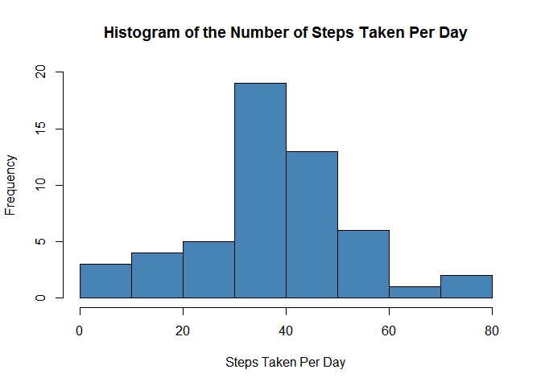
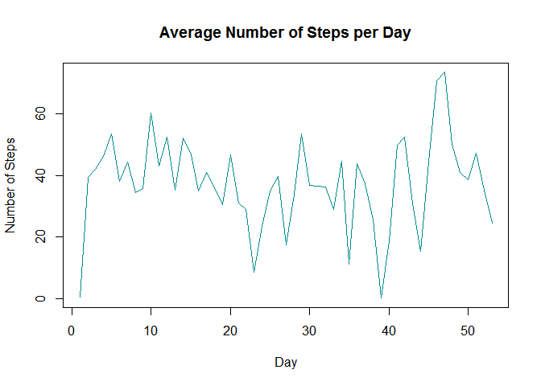
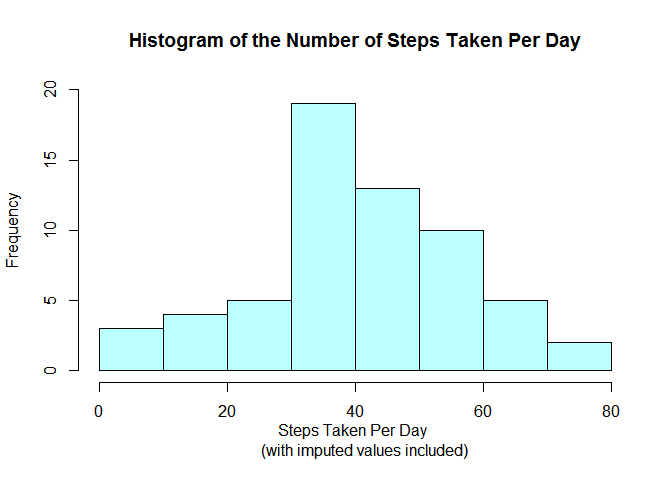
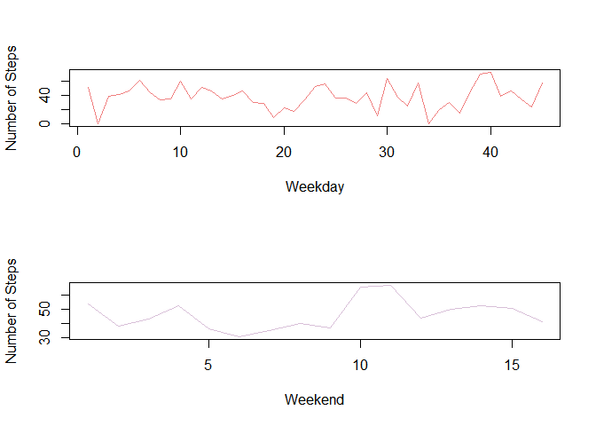

# Reproducible Research: Peer Assessment 1


### Isaac Dorfman
### September 18, 2017

## Loading and preprocessing the data

To insure maximum portability of code the importing and preprocessing of the  
data handled as such:


```r
tmp <- tempfile()
download.file("https://d396qusza40orc.cloudfront.net/repdata%2Fdata%2Factivity.zip",tmp)
activity <- read.csv(unz(tmp, "activity.csv"))
```

In the event that the URL for the data set changes in the future this portion  
of the code is easily updated for such contingency.  In the event that a  
future user of this code already has the data set stored locally then the  
read.csv function can be used by itself.

## What is mean total number of steps taken per day?

At this step in the analysis it is permissable to ignore the copious numer of  
NAs in the data set in order to get a better idea of what information we  
actually have.


```r
stepsday <- aggregate( steps ~ date, activity, mean)

steps_mean <- mean(stepsday$steps, na.rm = TRUE)
steps_mean
```

```
## [1] 37.3826
```

```r
steps_median <- median(stepsday$steps, na.rm = TRUE)
steps_median
```

```
## [1] 37.37847
```

We can also examine a histogram of the data to see why the mean is likely  
going to be more informative of further analysis than the median:


```r
hist(stepsday$steps, col = "steelblue", xlab = "Steps Taken Per Day",
     main = "Histogram of the Number of Steps Taken Per Day", ylim = c(0,20))
```

<!-- -->

From this we can see that for the days for which we have data that the  
overwhelming majority of days saw no activity from the device.

## What is the average daily activity pattern?

To get a better impression of the daily pattern the first step is going to be  
a simple time series plot:


```r
plot(stepsday$steps, type = "l", xlab = "Day", 
     ylab = "Number of Steps", 
     main = "Average Number of Steps per Day", col = "darkcyan")
```

<!-- -->

We would also like to know which interval saw the maximum number of steps:


```r
activity_max <- activity[which(activity[,"steps"]==max(activity$steps, na.rm = TRUE)),]
activity_max
```

```
##       steps       date interval
## 16492   806 2012-11-27      615
```

There are many different approaches to finding both the maximum value for a  
given variable and the associated observation.  This approach was selected  
because it would allow us to see if the maximum value occurred more than once.  
While it, as can be seen above, does not it is still a good idea to check for  
such possibilities.

## Imputing missing values

Before we can begin any imputation for missing values it would be helpful to  
know how many missing values we are dealing with and what percent of the total  
data set they represent.


```r
activity_missing <- sum(!complete.cases(activity))
activity_missing
```

```
## [1] 2304
```

```r
totals_obs <- nrow(activity)
percent_missing <- 100*(activity_missing/totals_obs)
percent_missing
```

```
## [1] 13.11475
```

It looks like a little over 13% of our data set is missing a value for the  
'steps' variable.  The next step is to come up with a reasonable estimate to  
fill in those missing values.  After some research on this topic the 'mice'  
package was selected to assist with creating an imputed data set to fill in the  
missing values.


```r
require("mice")
```

```
## Loading required package: mice
```

```r
md.pattern(activity)
```

```
##       date interval steps     
## 15264    1        1     1    0
##  2304    1        1     0    1
##          0        0  2304 2304
```

This verifies our earlier calculations for the number of missing values.  Time  
to impute their fill ins.  


```r
activity.imp <- mice(activity, m=1, method = "pmm", seed = 11235)
```

```
## 
##  iter imp variable
##   1   1  steps
##   2   1  steps
##   3   1  steps
##   4   1  steps
##   5   1  steps
```

```r
activity_complete <- complete(activity.imp,1)

stepsday_imp <- aggregate( steps ~ date, activity_complete, mean) 

steps_mean_imp <- mean(stepsday_imp$steps, na.rm = TRUE)
steps_mean_imp
```

```
## [1] 40.39356
```

```r
steps_median_imp <- median(stepsday_imp$steps, na.rm = TRUE)
steps_median_imp
```

```
## [1] 39.78472
```

```r
steps_mean_imp - steps_mean
```

```
## [1] 3.010957
```

```r
steps_median_imp - steps_median
```

```
## [1] 2.40625
```

The mean for our data set containing imputed values is a little over three  
steps per day higher while the mediam steps per day is around 2.5 steps higher.


```r
hist(stepsday_imp$steps, col = "paleturquoise1", xlab = "Steps Taken Per Day 
     (with imputed values included)",
     main = "Histogram of the Number of Steps Taken Per Day", ylim = c(0,20))
```

<!-- -->

## Are there differences in activity patterns between weekdays and weekends?

Since we are looking at activity levels it would be helpful to know if there  
are predictible periods of higher or lower activity than normal or if there is  
a predictible split in activity levels.  To this end a comparison of weekdays  
against the weekend.


```r
stepsday_imp$date <- strptime(stepsday_imp$date, "%Y-%m-%d")
days <- c("Monday","Tuesday","Wednesday","Thursday", "Friday")
stepsday_imp$weekday <- factor((weekdays(stepsday_imp$date) %in% days), 
                           levels=c(FALSE, TRUE), 
                           labels=c('weekend', 'weekday'))
```

Now that we have the factor variables 'weekday' we can creat a plot to see if  
there are any differences between weekdays and weekends.


```r
weekday_imp <- stepsday_imp[which(stepsday_imp[,"weekday"]=="weekday"),]
weekend_imp <- stepsday_imp[which(stepsday_imp[,"weekday"]=="weekend"),]

par(mfrow=c(2,1))

plot(weekday_imp$steps, type = "l", xlab = "Weekday", 
     ylab = "Number of Steps", 
     col = "lightcoral")

plot(weekend_imp$steps, type = "l", xlab = "Weekend", 
     ylab = "Number of Steps", 
     col = "thistle")
```

<!-- -->

Overall it appears as if people are less active overall on the weekend though  
it is worth noting that there are approximately three times as many weekdays  
as weekend days in our data set.
